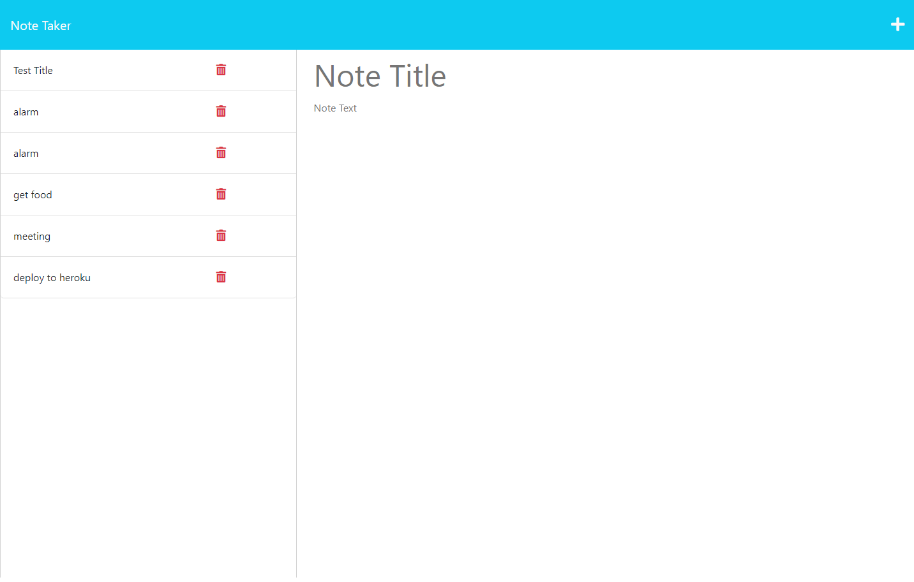

# 11 Express.js: Note Taker

## Project Description
This is a simple note-taker for taking quick notes to self, while still lacking the delete method I plan on returning to bring to further completion.

## How to use.
You can use this project by launching Server.js file in your command line and navigating to your localhost page. There you can enter a new note inside of note text and save that note by clicking on the save icon in the upper right!

## Project.

[Github Repo:](https://github.com/KeeslingB/express-notetaker)

Project Image: 